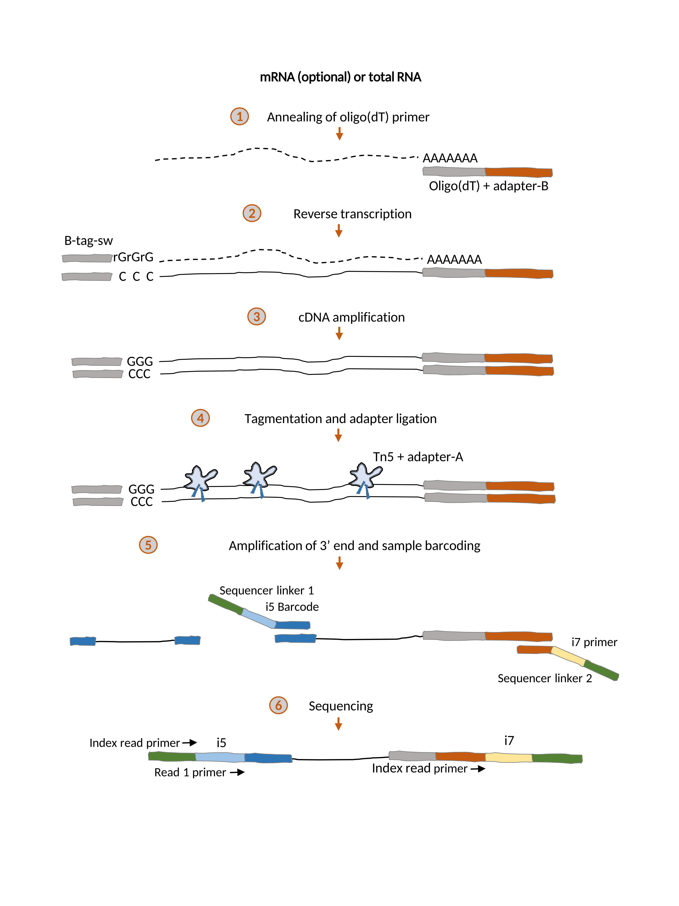

\| [Home](index) \| [Analysis Pipeline](pipeline) \| [mRNA Extraction protocol](mrna_extraction) \| [TM3'seq protocol](tm3seq_protocol) \| [Liquid-Handling Robot Protocols](robot_protocols) \|

## Abstract

RNA-seq has become the standard tool for collecting genome-wide expression data in very diverse fields, from ecology and developmental biology to quantitative genetics and medical genomics. However, RNA-seq library preparation as well as its sequencing requirements are still prohibitive for many laboratories, in particular when large sample sizes are involved. Recently, the field of single-cell transcriptomics has been able to reduce costs and increase throughput by adopting an approach that barcodes individual samples during reverse transcription and pools them before cDNA synthesis, effectively processing a single sample for most of the library preparation procedure. In contrast, RNA-seq protocols where each sample is processed individually are significantly more expensive and lower throughput than single-cell approaches. Yet, many experimental approaches are designed around follow-up experiments on a subset of samples, and therefore require that individual libraries are generated for each sample. In order to fill this gap, we have developed TM3’seq, a 3’-enriched library preparation protocol that uses Tn5 transposase and preserves the sample identity at each step. TM3’seq is designed for the high-throughput processing of individual samples (96 samples in 6h, with only 3h hands-on time) at a fraction of the cost of commercial kits ($1.5 per sample), while recovering gene expression profiles of the same quality as the commercial kits. We expect that the cost- and time-efficient features of TM3’seq make large-scale RNA-seq experiments more permissive for the entire scientific community.

**TM3'seq**
_Luisa Pallares, Julien F. Ayroles_
bioRxiv 000000; doi: <https://doi.org/10.1101/000000>

